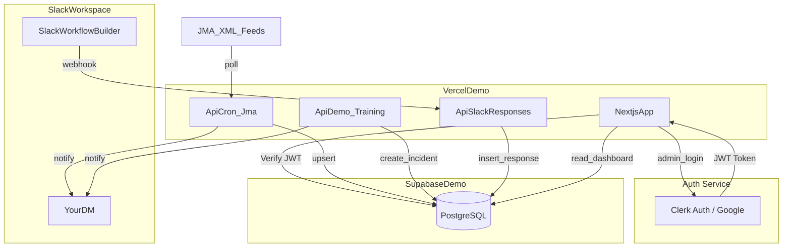

# デモ環境（案A）全体像

## 本番資料の参照

以下の「本番の一次リリース構成」をベースに、通知先だけを「あなたのDM」に置き換えています。

- 参照: `1_docs/manuals/報告用_実装前計画案_GenSpark台本_2025-12-22.md`

## 全体図

## デモで確認したい「最小の成立」

- **起動確認**（災害なしでOK）
  - `ApiDemo_Training` を叩くと `YourDM` に `[DEMO] 訓練です` が届く
- **監視確認**（災害なしでOK）
  - `ApiCron_Jma` を叩くと `DB(jma_entries)` が更新され、必要に応じて `YourDM` に通知が届く
- **回答確認**（デモで任意）
  - Workflow Webhook → `ApiSlackResponses` → `DB(responses)` が保存される

