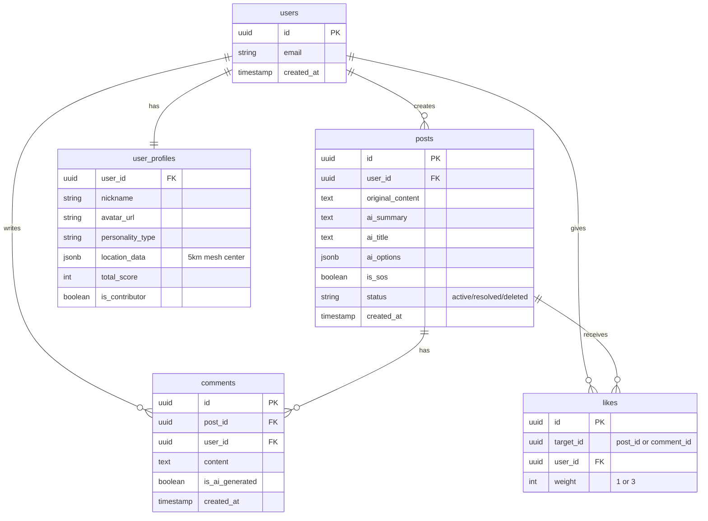

# データベース設計書

## 1. 概要
本プロジェクトでは、リレーショナルデータベースとして **PostgreSQL** (Supabase) を使用します。
ユーザー認証情報は **Clerk** で管理されますが、アプリケーション固有のユーザープロファイル情報はSupabase上の `users` および `user_profiles` テーブルで管理・紐付けを行います。

## 2. ER図 (Entity Relationship Diagram)

## 3. テーブル定義詳細

### 3.1 users (ユーザー管理テーブル)
Clerkのユーザー情報と紐づく、システム内部的なユーザーマスタです。
Supabase Authと連携する場合は `auth.users` を参照することもありますが、ここではアプリケーション管理下のテーブルとして定義します。

| カラム名 | データ型 | 制約 | 説明 |
| :--- | :--- | :--- | :--- |
| `id` | `uuid` | PK, Default: `gen_random_uuid()` | ユーザーID (Clerk IDと紐づけるか、別途管理) |
| `clerk_id` | `text` | Unique, Not Null | Clerk側のユーザーID |
| `email` | `text` | Not Null | メールアドレス |
| `created_at` | `timestamptz` | Default: `now()` | アカウント作成日時 |

### 3.2 user_profiles (ユーザープロフィール)
ユーザーの公開情報や属性を管理します。`users` テーブルと 1:1 の関係です。

| カラム名 | データ型 | 制約 | 説明 |
| :--- | :--- | :--- | :--- |
| `user_id` | `uuid` | PK, FK(users.id) | ユーザーID |
| `nickname` | `text` | Not Null | 表示名 |
| `avatar_url` | `text` | | アイコン画像のURL |
| `personality_type` | `text` | | 性格診断結果（例: "Giver", "Seeker"など） |
| `location_data` | `jsonb` | | 位置情報データ（5kmメッシュ中心座標など、プライバシー保護処理済み） |
| `total_score` | `integer` | Default: 0 | 貢献度スコア累計 |
| `is_contributor` | `boolean` | Default: false | 優良回答者フラグ |
| `updated_at` | `timestamptz` | Default: `now()` | 更新日時 |

### 3.3 posts (投稿)
ユーザーからの相談・投稿データを管理します。

| カラム名 | データ型 | 制約 | 説明 |
| :--- | :--- | :--- | :--- |
| `id` | `uuid` | PK, Default: `gen_random_uuid()` | 投稿ID |
| `user_id` | `uuid` | FK(users.id), Not Null | 投稿者ID |
| `original_content` | `text` | Not Null | ユーザーが入力した原文 |
| `ai_summary` | `text` | | AI生成された要約 (100文字程度) |
| `ai_title` | `text` | | AI生成されたタイトル (30文字程度) |
| `ai_options` | `jsonb` | | AI生成された選択肢（配列データ） |
| `ai_tags` | `text[]` | | AI生成された感情タグ（配列） |
| `is_sos` | `boolean` | Default: false | SOSモードフラグ |
| `status` | `text` | Default: 'active' | 状態 (`active`, `resolved`, `deleted`) |
| `created_at` | `timestamptz` | Default: `now()` | 投稿日時 |
| `updated_at` | `timestamptz` | Default: `now()` | 更新日時 |

### 3.4 comments (コメント/回答)
投稿に対する回答やコメントを管理します。

| カラム名 | データ型 | 制約 | 説明 |
| :--- | :--- | :--- | :--- |
| `id` | `uuid` | PK, Default: `gen_random_uuid()` | コメントID |
| `post_id` | `uuid` | FK(posts.id), Not Null | 対象の投稿ID |
| `user_id` | `uuid` | FK(users.id), Not Null | コメント投稿者ID |
| `content` | `text` | Not Null | コメント本文 |
| `is_ai_generated` | `boolean` | Default: false | AIによる自動生成コメントか否か |
| `created_at` | `timestamptz` | Default: `now()` | コメント日時 |

### 3.5 likes (評価/リアクション)
投稿やコメントに対する評価を管理します。スコア計算の基礎となります。

| カラム名 | データ型 | 制約 | 説明 |
| :--- | :--- | :--- | :--- |
| `id` | `uuid` | PK, Default: `gen_random_uuid()` | リアクションID |
| `target_id` | `uuid` | Not Null | 対象ID (post_id または comment_id) |
| `target_type` | `text` | Not Null | 対象種別 (`post` または `comment`) |
| `user_id` | `uuid` | FK(users.id), Not Null | リアクションしたユーザーID |
| `weight` | `integer` | Default: 1 | 重み付け（投稿者本人の場合3、他者の場合1） |
| `created_at` | `timestamptz` | Default: `now()` | リアクション日時 |
| `unique_constraint` | (複合) | Unique(target_id, user_id) | 1つの対象に重複してリアクション不可 |

## 4. セキュリティ設計 (RLS: Row Level Security)

SupabaseのRLS機能を有効化し、以下のポリシーを適用します。

- **public_read**: 全てのテーブルに対し、認証済みユーザーは `SELECT` 可能。
    - ただし、`deleted` ステータスの投稿は所有者以外参照不可にするなどのフィルタリングを行う。
- **owner_update**: `posts`, `user_profiles` などは、`user_id` が `auth.uid()` と一致する場合のみ `UPDATE`/`DELETE` 可能。
- **authenticated_insert**: 認証済みユーザーのみ `INSERT` 可能。`user_id` には自身のIDが強制的にセットされるようにする。

## 5. インデックス設計

パフォーマンス向上のため、以下のカラムにインデックスを作成します。

- `posts`: `created_at` (タイムライン表示用), `user_id` (マイページ表示用), `is_sos` (SOSフィルタリング用)
- `comments`: `post_id` (投稿詳細表示用)
- `likes`: `target_id` (集計用)

