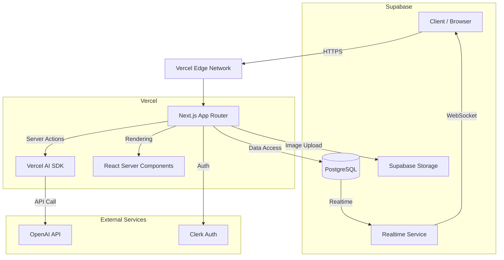

# システムアーキテクチャ設計書

## 1. 技術スタック選定

本プロジェクト「kococo」では、開発速度、スケーラビリティ、およびメンテナンス性を重視し、以下のモダンな技術スタックを採用します。

### 1.1 コアフレームワーク
- **Framework**: **Next.js 14+ (App Router)**
    - **選定理由**: React Server Components (RSC) による初期表示パフォーマンスの最適化、SEO対策（将来的な拡張性）、Server ActionsによるAPIルートレスなバックエンドロジックの実装が可能であるため。Vercelとの親和性が高く、デプロイワークフローが容易。
- **Language**: **TypeScript**
    - **選定理由**: 静的型付けによるコードの品質担保と、開発体験（DX）の向上。

### 1.2 インフラストラクチャ & バックエンド
- **Platform**: **Vercel**
    - **選定理由**: Next.jsのホスティングに最適化されており、Edge Networkによる高速配信、CI/CDの自動化が標準で提供されるため。
- **Database**: **Supabase (PostgreSQL)**
    - **選定理由**: フルマネージドなPostgreSQLであり、リレーショナルデータのリッチなクエリが可能。Row Level Security (RLS) による堅牢なセキュリティ、Realtime機能による即時更新通知が利用可能。
- **Auth**: **Clerk**
    - **選定理由**: 認証・認可機能の実装コストを最小限に抑えられる。モダンなUIコンポーネントが提供されており、ユーザー管理機能も充実している。
- **Storage**: **Supabase Storage**
    - **選定理由**: 画像などのメディアファイルのホスティングに使用。Supabaseの認証と統合されたアクセス制御が可能。

### 1.3 AI & 外部サービス
- **AI**: **OpenAI API (gpt-4o-mini / gpt-4o)** via **Vercel AI SDK**
    - **選定理由**: 高精度なテキスト解析と生成能力。Vercel AI SDKを利用することで、ストリーミングレスポンスなどの実装が容易になる。
- **Monitoring**: **Sentry**, **Vercel Analytics**
    - **選定理由**: エラー追跡とパフォーマンス監視のため。

## 2. アーキテクチャ概要

システム全体の構成図を以下に示します。クライアント（ブラウザ）からEdge Networkを経由してNext.jsサーバーにアクセスし、そこから各外部サービスへ連携します。



### コンポーネントの役割
- **Next.js App Router**: アプリケーションのメインロジック。ルーティング、ページレンダリング、APIエンドポイント（Server Actions）を提供。
- **React Server Components (RSC)**: サーバー側でレンダリングを行い、クライアントへの転送データ量を削減。データベースへの直接アクセスもここで行う。
- **Server Actions**: クライアントからのデータ送信（フォーム投稿など）を処理するサーバーサイド関数。APIルートを個別に作成することなく、タイプセーフな通信が可能。

## 3. コンポーネント設計

Next.jsの Server/Client Components パターンに基づいたコンポーネント階層と責務分担を定義します。

### 3.1 コンポーネント階層図

```mermaid
graph TD
    Layout[RootLayout (Server)]
    Layout --> AuthProvider[ClerkProvider (Client)]
    AuthProvider --> Header[Header (Server)]
    AuthProvider --> Main[Main Content]
    
    Main --> TimelinePage[TimelinePage (Server)]
    TimelinePage --> PostList[PostList (Server)]
    PostList --> PostCard[PostCard (Client)]
    PostCard --> LikeButton[LikeButton (Client)]
    
    Main --> NewPostPage[NewPostPage (Client)]
    NewPostPage --> AIPreview[AIPreview (Client)]
    
    Main --> PostDetailPage[PostDetailPage (Server)]
    PostDetailPage --> CommentSection[CommentSection (Client)]
```

### 3.2 主要コンポーネント定義

#### TimelinePage (Server Component)
- **役割**: タイムライン画面のルート。
- **データ取得**: Supabaseから投稿データを非同期で取得 (`await supabase.from('posts').select(...)`)。
- **Props**: なし（URLパラメータからクエリ条件を取得）。
- **責務**: 初回データフェッチ、SEOメタデータ生成。

#### PostList (Server Component)
- **役割**: 投稿リストのレンダリングラッパー。
- **Props**: `initialPosts: Post[]`
- **責務**: 取得した投稿データのリスト展開。空状態（Empty State）のハンドリング。

#### PostCard (Client Component)
- **役割**: 個別の投稿カード表示。
- **Props**: `post: PostType`
- **State**:
    - `isExpanded`: boolean (全文表示/要約表示の切り替え)
    - `optimisticLike`: boolean (いいねのOptimistic UI用)
- **責務**:
    - ユーザーインタラクション（いいね、詳細へ遷移）のハンドリング。
    - Optimistic UIによる即時フィードバック。

#### NewPostForm (Client Component)
- **役割**: 新規投稿フォーム。
- **State**:
    - `formData`: フォーム入力値 (React Hook Form + Zod で管理)
    - `isAnalyzing`: boolean (AI解析中フラグ)
    - `analysisResult`: AI解析結果（要約、タイトル、選択肢）
- **責務**:
    - ユーザー入力のバリデーション。
    - Server Actions (`analyzePost`, `createPost`) のトリガー。
    - AI解析中のローディング表示（研究室風アニメーション）。

#### CommentSection (Client Component)
- **役割**: 投稿詳細画面でのコメント一覧表示と投稿フォーム。
- **Props**: `postId: string`, `initialComments: Comment[]`
- **State**:
    - `comments`: Comment[] (リアルタイム更新用)
- **責務**:
    - コメントの追加・表示。
    - Supabase Realtime (Subscription) を利用した新着コメントの自動反映。

## 4. データフローの方針

1.  **データ取得 (Read)**:
    - 原則として **Server Components** で行う。
    - 必要なデータはPropsとしてClient Componentsに渡す（Waterfalls防止のため、可能な限り親コンポーネントでまとめて取得）。
2.  **データ更新 (Write)**:
    - **Server Actions** を使用する。
    - クライアント側では `useOptimistic` フックなどを活用し、サーバーレスポンスを待たずにUIを更新することで体感速度を向上させる。
3.  **状態管理**:
    - グローバルステート（Redux/Zustand等）はMVP段階では導入せず、React Context または URL State（クエリパラメータ）で管理する。
    - 認証状態は Clerk の `useUser`, `useAuth` フックを利用。

